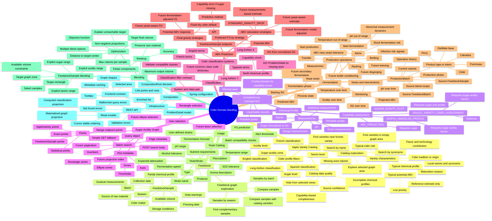

# Backlog Mind Map

```mermaid
mindmap
  root((Cider Domain Backlog))
    Apple Variety Catalog
      Catalog exploration
        Search by name
        Search by synonyms
        Explore selected graph area
        Find varieties near known variety
        Find varieties in empty graph area
      Cider profile filters
        Sugar-acidity zone
        Sugar level
        Acidity level
        Tannin level
        English classification
        French classification
        Spanish classification
        Long Ashton classification
      Catalog data quality
        Incomplete chemical profiles
        Missing axes reports
        Capability-based completeness
        Source confidence
        Hide from selected views
      Variety characteristics
        Local names and synonyms
        Cider tradition or origin
        Maturation season
        Typical chemical profile
        Typical cider role
        Flavor and technology contribution
        Typical potential ABV
          Low priority
          Reference estimate only
    Feedstock
      FeedstockSample
        Partial chemical profile
        Gradual measurements
        Data warnings
        Season
        Batch
        Cider maker
        Collection date
        Pressing date
        Storage conditions
        Source of raw material
        Available volume
      Feedstock graph exploration
        Samples by season
        Samples by batch
        Compare samples
        Compare samples with catalog varieties
        Find complementary samples
    Chemical Profile
      Measurements
        Sugar normalized to SG
        Titratable acidity
        Tannin
        pH
        Exact measurement
        Range measurement
        Statistical measurement
      Capability assessment
        SUGAR_ACIDITY_PLOT
          Requires sugar and acidity
        NORTH_AMERICAN_PROFILE
          Requires sugar acidity tannin
        ABV_PREDICTION
          Requires sugar
        SINGLE_VARIETY_CIDER_ASSESSMENT
          Deferred
          Requires sugar acidity tannin
      Completeness management
        Plottable points
        Unplottable records
        Missing axes
        ProblemDetails for capability errors
    Sugar-Acidity Graph
      Plot metadata
        Axes
        Thresholds
        Zones
        Rectangle zones
        Ellipse zones
      Points
        AppleVariety points
        FeedstockSample points
        Exact points
        Range midpoint points
        Statistical points
      User selection
        Rectangle selection
        Future ellipse selection
        Future lasso selection
      Batch search
        Query object
        POST search body
        Simple GET fallback
        Cursor pagination
        Page metadata
        Overfetch
        Future projection index
    Classification
      North American profile
        Capability check
        422 ProblemDetail on missing axes
      Cider classification systems
        English terms
        French terms
        Spanish terms
        Long Ashton 4
        Long Ashton 7
      Classification filter contract
        System and class pair
        Validate compatible classes
        Future common class code dictionary
    ABV Prediction
      Potential ABV
        FeedstockSample endpoint
        OG from normalized SG
        Predicted FG by strategy
      Final gravity strategies
        Fixed dry cider default
        Future yeast-aware FG
        Future fermentation-adjusted FG
      ABV calculation strategies
        STANDARD_GRAVITY_DROP
        Future yeast-aware estimate
        Future fermentation model adjusted
        Future measurements based estimate
      API
        Potential ABV response
        Prediction method
        Capability error if sugar missing
    Fermentation
      ProductionBatch
        Product type or intent
          Cider
          Perry
          Distillate base
          Calvados
          Pommeau
        Source FeedstockBatch
        Source FeedstockSample
        Source blend recipe
        Current volume
        Operation history
        Production phase
      Production operations
        Start production
        Start fermentation
        Measurement
        Racking
        Transfer
        Bottling
        Future keeving
        Future secondary fermentation
        Future bottle conditioning
        Future disgorging
      Fermentation phase
        Starting SG
        Predicted ABV
        Yeast strain
        Process state
      Monitoring
        SG over time
        Temperature over time
        pH over time
        Acidity over time
        Projected ABV
        Notes and interventions
      Alerts
        Stuck fermentation risk
        Infection risk signals
        Temperature out of range
        pH out of range
        ABV near yeast tolerance
        Abnormal measurement dynamics
    Yeast Catalog
      YeastStrain
        Producer
        Strain name
        Type
        Temperature range
        pH range
        Alcohol tolerance
        Expected attenuation
        Nutrient requirements
        Fermentation speed
        Aroma descriptors
        Flocculation
        SO2 tolerance
      Usage
        Fermentation forecast
        FG prediction
        Alert thresholds
        Batch compatibility checks
        User-defined strains
    Blending
      FeedstockSample blending
        Select samples
        Target graph zone
        Target rectangle
        Explicit sugar range
        Explicit acidity range
        Explicit tannin range
        Available volume constraints
      Optimization
        Objective function
        Distance to target center
        Non-negative proportions
        Max volume per sample
        Target final volume
        Multiple blend options
        Explain unreachable target
      Ranking
        Accuracy
        Preserve rare material
        Fewer components
        Maximum output volume
    Infrastructure
      REST API
        ProblemDetail model
        Validation errors
        Not found errors
        Malformed query errors
      Read models
        Materialized graph projection
        Computed classification projection
        Cursor stable ordering
      Frontend contract
        Metadata caching
        Graph shapes
        Tooltips
        Selected area
        Enriched list
        Link points and rows
      Composition
        CompositionRoot decision
        Spring configuration
```
